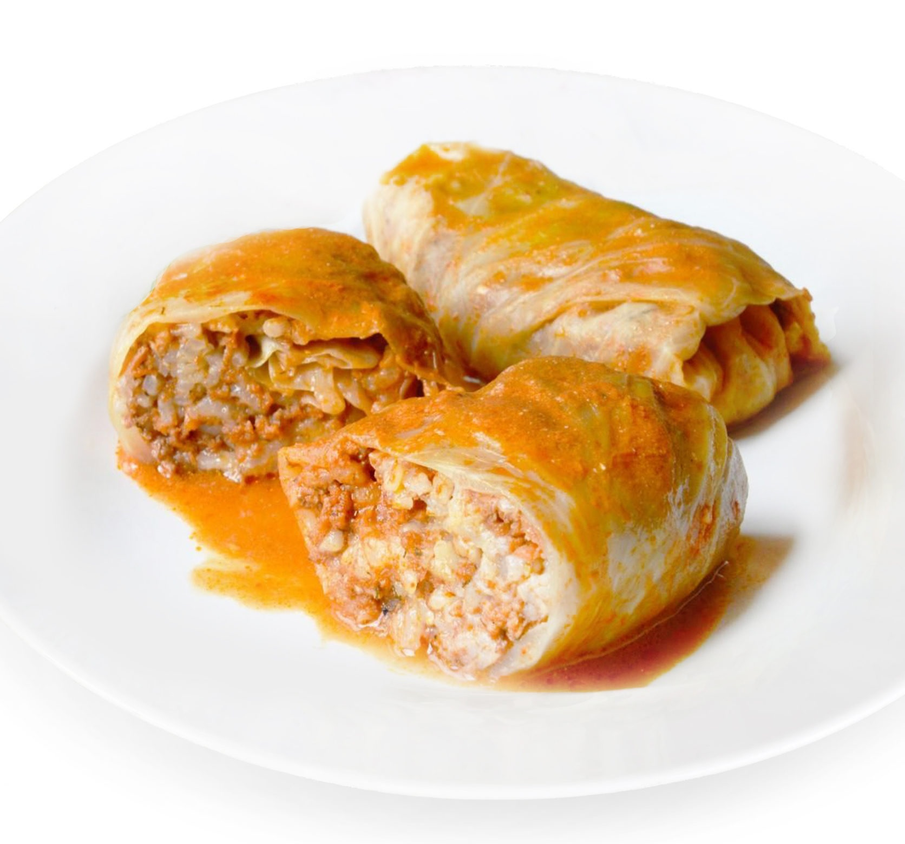

## Рецепт голубцов

### *Необходимые продукты*
- Капуста белокачанная - 1шт.
- Рис 1 стакан.
- Фарш мясной - 500 г.
- Морковь - 1шт.
- Лук репчатый - 4-5 шт.
- Кетчуп или томатный соус - 3 ст.л.
- Масло растительное - для жарки.
- Перец молотый (красный и черный).
- Сахар.
- Соль.

### *Пошаговый рецепт*
- Подготовим капустные листья для голубцов
- Измельчим лук и морковь
- Поджарим овощи на растительном масле до готовности и разделим на две части. Одну часть используем для начинки. Во вторую часть добавим соль (1 ст. л.), сахар (1 ст. л.), молотый перец и томатный соус или кетчуп.
- Немного обжарим овощи с томатом, дольем воду (2-3 стакана) и закипятим томатную подливу.
- Смешаем сваренный заранее рис, фарш и овощную зажарку. Начинку для голубцов посолим, поперчим и перемешаем
- Закрутим голубцы с мясом и рисом.
- Голубцы выложим в кастрюлю и зальем томатной подливой.
- Готовим голубцы на небольшом огне примерно 1 час

*Приятного аппетита*

